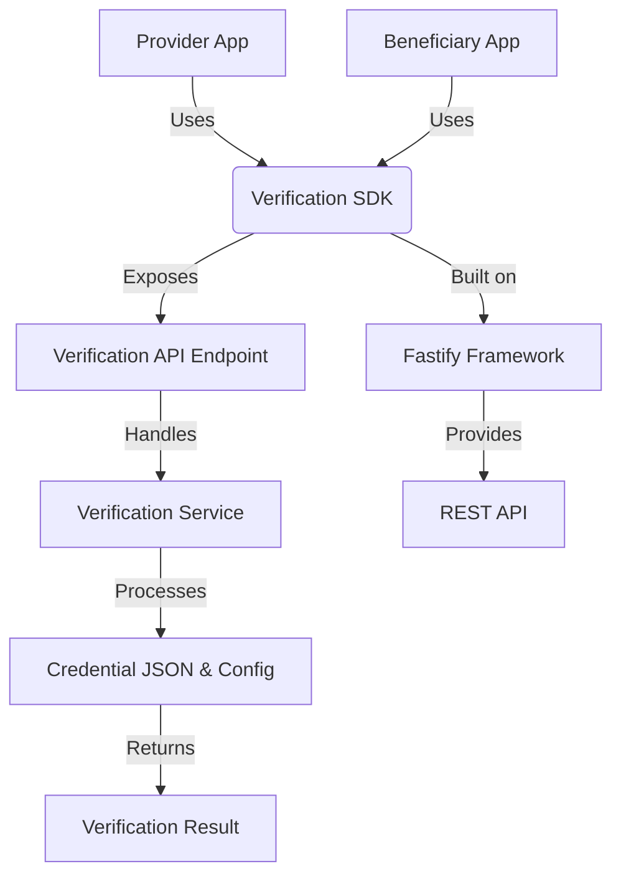
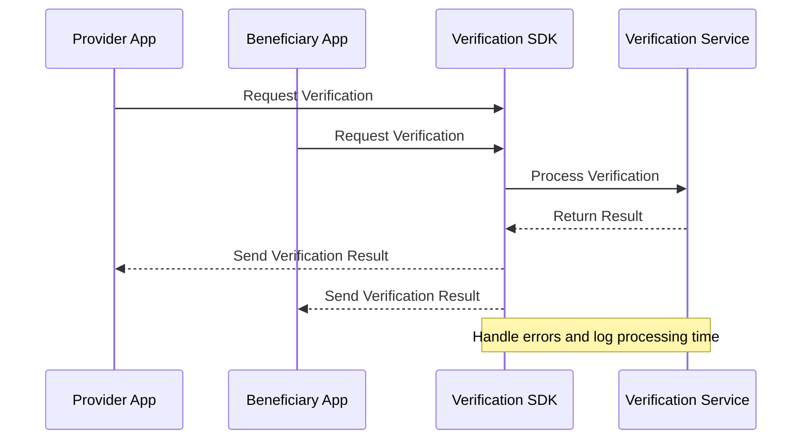
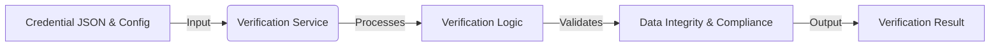

# Service Architecture

## Overview

This section provides an overview of the Verification SDK's architecture, including its components and interactions.

## Architecture Diagram

### Explanation

- **Provider App & Beneficiary App**: These applications interact with the Verification SDK to verify documents.
- **Verification SDK**: Acts as the core component, exposing a REST API for verification.
- **Verification Service**: Processes the verification requests and returns results.
- **Fastify Framework**: Provides the underlying infrastructure for the REST API.

## Sequence Diagram

### Explanation

- **Request Verification**: Both apps send verification requests to the SDK.
- **Process Verification**: The SDK processes these requests through the Verification Service.
- **Return Result**: Results are returned to the apps, with error handling and logging.

## Data Flow Diagram

### Explanation

- **Input**: Credential JSON and configuration data are input into the Verification Service.
- **Processing**: Data undergoes verification logic and validation.
- **Output**: The final output is the verification result.
